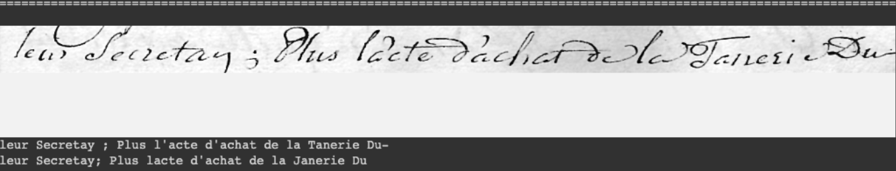

# Handwritten Text Recognition (HTR) and the Notebooks of Jean-Henri Polier de Vernand (1715-1791)

Since 2021, the [Archives cantonales vaudoises (ACV)](https://www.vd.ch/toutes-les-autorites/archives-cantonales-vaudoises-acv) and the [Collège des Humanités Digitales (CDH)](https://www.epfl.ch/schools/cdh/fr/) at EPFL – more precisely the [Lausanne Time Machine project](https://www.epfl.ch/schools/cdh/lausanne-time-machine/fr/lausanne-time-machine/) – are collaborating to digitalized the notebooks of Jean-Henri Polier de Vernand. 

As a master's thesis, we applied Handwritten Text Recognition (HTR) technology – using TensorFlow, [Transkribus](https://readcoop.eu/transkribus/) and [HTR-Flor](https://github.com/arthurflor23/handwritten-text-recognition) – to the 26'300 pages that make up the notebooks of Lausanne's bailiff lieutenant. 

This was a part of my Master degree in [Digital Humanities](https://www.unil.ch/lettres/fr/home/menuinst/formations/master-en-humanites-numeriques.html) and [History](https://www.unil.ch/hist/fr/home/menuinst/formations/maitrise-universitaire-1.html) at the University of Lausanne in Switzerland. 

This git presents both the results of this research and the methodology used to transform this valuable source of Lausanne's eighteenth-century history into a digital format.

As part of our evaluation of this automatic handwriting recognition model, we assessed the *Character Error Rate* (CER). The CER measures the minimum number of character modification operations required to align a word with the *ground truth*. 

Our achievement is highlighted by a **CER of just 8.78%**, showcasing the precision of our model in preserving the historical content. As a general guideline, a CER below 10% is considered usable, and below 5% is deemed very good, with the remaining errors typically attributed to rare or unknown words. This achievement underscores the efficacy of our approach in transcribing and conserving the invaluable insights embedded within these historical documents.


*The results of the HTR process can be find [here]().* <!-- AJOUTER LIEN RELATIF -->

Table of Contents
=================
* [Jean-Henri Polier de Vernand (1715-1791)](#jean-henri-polier-de-vernand-1715-1791)
* [Methodology](#methodology)
    * [Training set with Transkribus](#training-set-with-transkribus)
        * [Samples](#sample)
    * [HTR-Flor by Arthur Flor](#htr-flor-by-arthur-flor)
* [Results](#results)
    * [JSON Files's nomenclature for referencing as a source](#json-filess-nomenclature-for-referencing-as-a-source)


## Jean-Henri Polier de Vernand (1715-1791)
Lausanne in 1715 and served there from 1754 until his death in 1791 as lieutenant baillival of Lausanne, thus acting as a substitute for the Bernese bailli [^1]. A member of two Lausanne Councils, the Baillivale Court, the Court of Fiefs, the Criminal Court of the Castle, the Court of the Chapter and a member of the Court of the Rue de Bourg through his status as a landowner, he was one of the most important figures in Lausanne society of his time[^2]. Moreover, Polier kept numerous notebooks from 1754 until his death, in which he methodically transcribed his personal day-to-day life on more than 26,300 pages, thereby creating one of the most important documents in the history of Lausanne[^3].

*For more information, a copy of my master’s thesis in French can be found [here](Master_thesis_Kauffmann_2023.pdf).* 

[^1]: Abetel Emmanuel, « Polier de Vernand, Jean-Henri », [hls-dhs-dss.ch](https://hls-dhs-dss.ch/articles/017839/2009-04-20/), consulté le 03.03.2023.
[^2]: Morren Pierre, La vie lausannoise au XVIIIe siècle: d’après Jean-Henri Polier de Vernand, lieutenant baillival, Genève : Labor et Fides, 1970
[^3]: Abetel Emmanuel, « Polier de Vernand, Jean-Henri »…, [art. cit.](https://hls-dhs-dss.ch/articles/017839/2009-04-20/)


## Methodology 

### Training set with Transkribus 

In order to develop an automatic handwriting recognition model, we had to make a number of transcriptions of Polier de Vernand's notebooks in order to generate data for training the model. To do this, we used [Transkribus](https://readcoop.eu/transkribus/), which allows us to transcribe documents free of charge and to analyse document layout in order to detect text segmentation.

This data set must reflect a variety of page layouts, vocabulary and writing styles, either by selecting specific pages or by selecting pages at regular intervals. Thus, to build our data set for training our model, we made a selection both for specific pages in certain notebooks with particular features or the presence of a lot of numbers for example but also for certain pages at intervals of 10 pages.

| Notebook number : | Page(s): | Notebook number : | Page(s):  |
|:---------:|:---------:|:---------:|:---------:|
| 001 | 4-5-6-49 | 090 | 10 |
| 010 | 10-20 | 100 | 10-30-50 |
| 020 | 4-5-6-7-8 | 110 | 8 |
| 040 | 7-8-41-51 | 125 | 50 |
| 050 | 10 | 145 | 20-30 |
| 060 | 10-20-30-40 | 155 | 10-20 |
| 070 | 10 | 160 | 10-19-28-41 |
| 080 | 10-30-50| 185 | 10-20 |

<sup><sup>Total: 40 digitised pages transcribed (double page handwritten notebook)</sup></sup>

At the start of this project, Transkribus seemed perfectly suited to the task of creating training data and using it to create a prediction model. However, since at least 2021, Transkribus has set a limit on the number of pages that can be transcribed free of charge, which meant that we were unable to cover the 26,300 pages written by Polier within a reasonable budget. The software currently offers the option of applying an HTR template to 500 handwritten pages free of charge, followed by a fixed price starting at €18 for 120 credits and €2,160 for 10,000 credits - 1 credit corresponding to 1 handwritten page.

For this reason, we turned to the [*HTR-Flor++*](#htr-flor-by-arthur-flor) text recognition model which, although not as easy to use for a user less accustomed to programming language - one of the main advantages of Transkribus - enabled us to obtain similar results. 

#### Sample 

<!-- Mettre un exemple de reconnaissance des pages du cahiers  -->


### HTR-Flor by Arthur Flor 
<!-- Preentrainement sur Bentham Data Set -->




Example of transcription after learning from training data


## Results 


``` json
[
{
"cahier_n": 91,
"page_n": 3,
"transcription": "mercredi 1 avril ; 1778 \n
du mercredi 1er avril ;, \n mon frere a la haye; \n
jattendois aver bien de l’impatience mon cher frere \n votre
lettre du 7 du mois passe, je suis afflige plus \n que je ne
puis vous le dine des tristes nouvelles que \n lus donnez de
l’etat de votre sante, je sousse in \n finiment de ves maux
& prie le ciel avec ardeur de \n les adoucir, je vais
lanquir jusqu’a ce que vous avi \n siez de votre arrivee a
la haye. vous demand. \n rais la place de me faire ecrire
par le secretaire de \n mr de, pour peu qu vous soyez
fatique d’t \n vaquer vous meme ; je voudrois pouvoir
esperer \n que la douce chaleur du printemps donnera un \n
peu de jeu a vos membres & dissipera vos fluxions \n, mais
lorsque le vent d’est soufler a avec riguenr \n n’y aura
t’il pas moyen de vous dispenser d’etre \n present a ces
longr exercices vous avez ete si \n souvent de tour qu’il
seroit juste de laisser une \n partie du travail a ceux qui
ont moins apereque \n vous ; nous venons d’avoir une
commolion \n agreable & triste dans la parente; la fille de
mr. le \n don, aimable, douee de beaucoup desprit & de \n
pande tulenr a suljuque depuis quelques mois \n de sentimens
profonds destime & d’amour un jeu \n n: seigneur anglais
pair d’irlande sous le titre \n de gatxay, age de 20 ans,
ayant avec lui mne \n espece de gouverneur du pays, momme le
minf \n combe; le jeune seigneur pour legitimer se \n
passion ; parl. sacrement il s’est fait ecouter \n en a
voulu excopter de sa minorite on a miste \n sur le
consentement de les parent, l’epouse ma op \n pes qu’il ne
pouvoit sarreter a ces lonqueurs \n qu’il etois trop
emflamme pour attendre,; il a \n bien d illu ceder a des
instances si fortes ; les \n cennes ces velles qui se sont
melees de cette \n faure n’ont pas trop bien combine taut
ola \n dim: 2 mars a 6 h 1/2 du soir, mylard apres \n "
}
]
```


#### JSON Files's nomenclature for referencing as a source 
<!-- Explication des numéros de pages etc.  -->

``` json
[
    {
        "cahier_n": 91,
        "page_n": 3,
        "transcription": "mercredi 1 avril ; 1778 \n du mercredi 1er avril ;, \n mon frere a la haye; \n jattendois aver bien de l'impatience mon cher frere \n votre lettre du 7 du mois passe, je suis afflige plus \n que je ne puis vous le dine des tristes nouvelles que \n v lus donnez de l'etat de votre sante, je sousse in \n finiment de ves maux & prie le ciel avec ardeur de \n les adoucir, je vais lanquir jusqu'a ce que vous avi \n siez de votre arrivee a la haye. vous demand. \n rais la prace de me faire ecrire par le secretaire de \n mr de, pour peu qu vous soyez fatique d't \n vaquer vous meme ; je voudrois pouvoir esperer \n que la douce chaleur du printemps donnera un \n peu de jeu a ves membres & dissipera vos fluxions \n mais lorsque le vent d'est soufler a avec riguenr \n n'y aura t'il pas moyen de vous dispenser d'etre \n present a ces longr exercices vous avez ete si \n souvent de tour qu'il seroit juste de laisser une \n partie du travail a ceux qui ont moins apereque \n vous ; nous venons d'avoir une commolion \n agreable & triste dans la parente; la fille de mr. le \n don, aimable, douee de beaucoup desprit & de \n pande tulenr a suljuque depuis quelques mois \n de sentimens profonds destime & d'amour un jeu \n n: seigneur anglais pair d'irlande sous le titre \n de gatxay, aye de 20 ans, ayant avec lui mne \n espece de gouverneur du pays, momme le minf \n combe; e jeune seigneur pour legitimer se \n passion ; parl. sacrement il s'est fait ecouter \n en a voulu excopter de sa minorite on a miste \n sur le consentement de les parant, l'epousema op \n pes qu'il ne pouvoit sarreter a ces lonqueurs \n qu'il etois trop emzlamme pour attendre,; il a \n bien d illu ceder a des instances si fortes ; les \n cennes ces velles qui se sont melees de cette \n faure n'ont pas trop bien combine taut ola \n dim: 2 mars a 6 h 1/2 du soir, mylard agmes \n "
    }
]
```